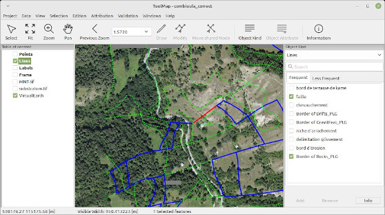

# ToolMap 

ToolMap is a cost-free, open-source software dedicated for digitizing data and producing complex multi-layer GIS projects.

The user documentation can be found here: http://toolmap.readthedocs.io

Build instruction : [doc/build_instructions.md](doc/build_instructions.md)