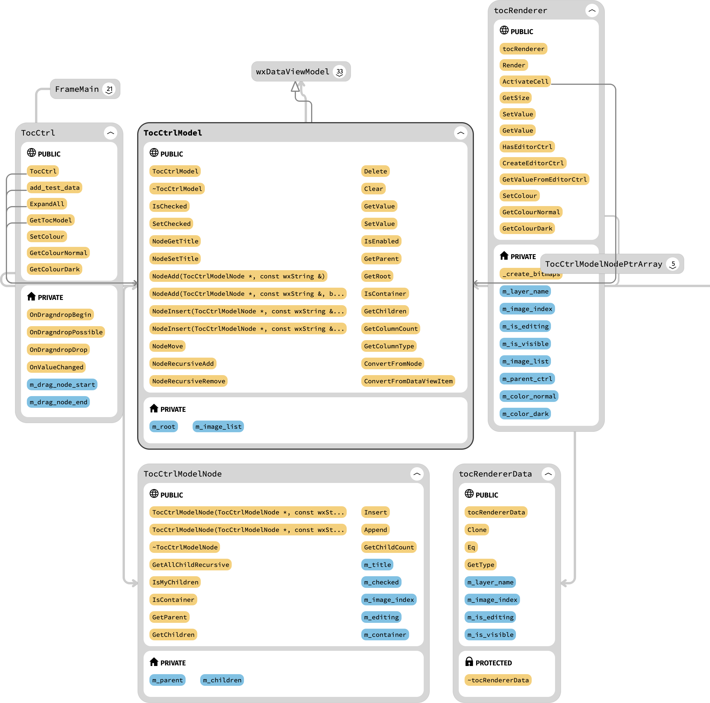

# Refonte TOC

## Fonctionnement

La TOC est actuellement pilotée par tmTocCtrl (wxTreeCtrl).

## Chargement

Lors de l’ouverture d’un projet, ProjectManager::Openproject appelle tmLayerManager::InitLayerManager qui  appelle tmLayerManager::FillTOCArray. Cette fonction appelle DatabaseTM::GetNextTocEnty qui va interroger la BDD pour récupèrer les couches.

La TOC est crée avec la commande SQL suivante. 

        prj_toc	CREATE TABLE `prj_toc` (
        `CONTENT_ID` int(10) unsigned NOT NULL AUTO_INCREMENT,
        `TYPE_CD` int(10) unsigned NOT NULL,
        `CONTENT_PATH` varchar(255) DEFAULT NULL,
        `CONTENT_NAME` varchar(255) DEFAULT NULL,
        `CONTENT_STATUS` tinyint(1) DEFAULT 1,
        `GENERIC_LAYERS` tinyint(4) DEFAULT 100,
        `RANK` int(11) DEFAULT NULL,
        `SYMBOLOGY` mediumtext DEFAULT NULL,
        `VERTEX_FLAGS` tinyint(4) DEFAULT NULL,
        `LABEL_VISIBLE` tinyint(1) DEFAULT 0,
        `LABEL_DEF` mediumtext DEFAULT NULL,
        PRIMARY KEY (`CONTENT_ID`),
        KEY `PRJ_TOC_FKIndex1` (`TYPE_CD`))

## Sauvegarde

 1. ProjectManager::CloseProject
 2. tmLayerManager::UnInitLayerManager
 3. tmLayerManager::SaveTOCStatus (private) 
 4. DatabaseTM::PrepareTOCStatusUpdate() *permet de préparer la requête pour mettre à jour la TOC,
 C'est nécessaire pour enregistrer la Symbologie des couches*
 5. DatabaseTM::DatabaseQueryNoResults() *Met à jour la TOC*

Au final la table TOC dans la base de donnée correspond à l'image ci-après

## Bookon

Utilise également un wxTreeCtrl (le control)

Utilise également une classe de jonction ControlMain qui fait le lien entre la TOC et la liste.

Création d'une classe dérivée de wxTreeItemData (classe qui contient les informations sur le type
des éléments).

## Branche Feature_toc

Après plusieurs essais, ce qui semble fonctionner pour le nouveau contrôle pour la TOC est architecturé comme illustré ci-après

Le contrôle principal est un TocCtrl (basé sur wxDataViewCtrl), il intègre un TocCtrlModel dérivé de wxDataViewModel. 
Ce modèle contient un array de TocCtrlModelNode (pas de classe parent).

### Classes et responsabilités

| Classe           | Description                                                           |
|------------------|-----------------------------------------------------------------------|
| TocCtrl          | Gère le contrôle, les événements, le model                            |
| TocCtrlModel     | Contient les différents Nodes                                         |
| TocCtrlModelNode | Contient les données de chaque noeud                                  |
| TocRenderer      | S'occupe de la gestion du rendu de la colonne                         |
| TocRendererData  | Contient les données nécessaire pour le rendu, basé sur wxVariantData |

### Fonctionnement

Les étapes suivantes sont effectuées lors de la création du TocCtrl :

1. TocCtrlModel est crée et assignée au TocCtrl.
2. Une colonne est crée, elle est assignée au TocCtrl et pour son rendu, la classe TocRender est utilisée
